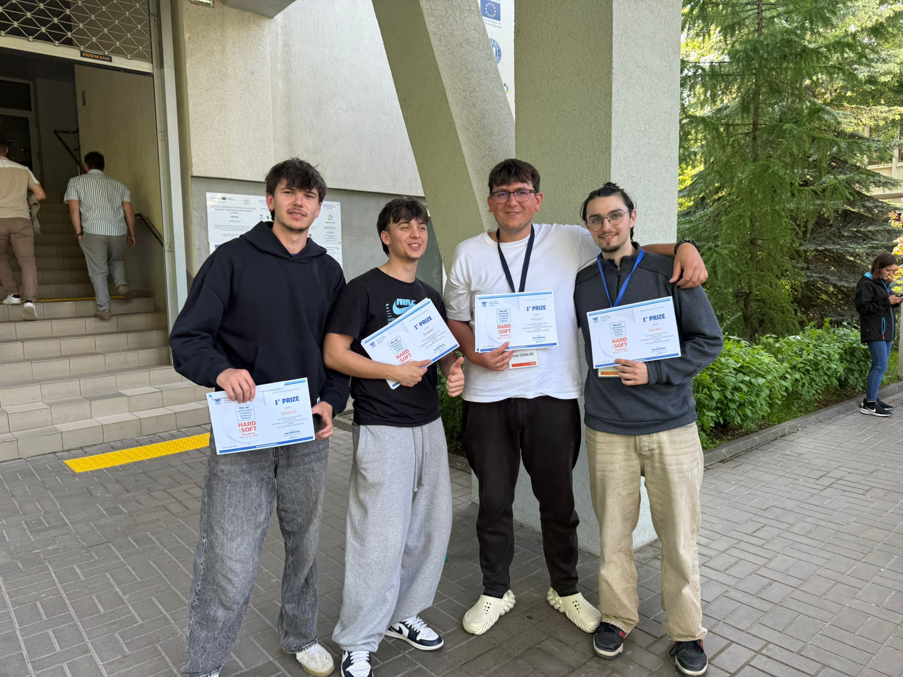
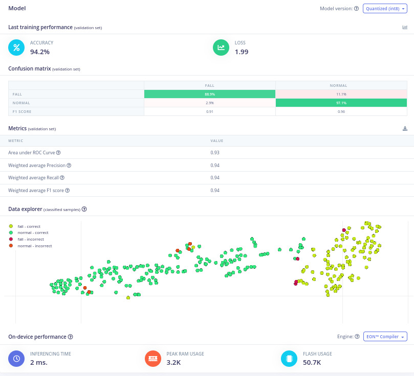

# Guardian — Fall-Detection Wearable & Caregiver Companion

> 🏆 **1st place out of 16 teams — HARD & SOFT Suceava 2026** · team **_Sudo_** (Suceava 2)
>
> 🌐 **Live demo:** <https://guardian-companion.tech>

A wearable fall-detection and vital-monitoring device for elderly users, plus
a real-time caregiver dashboard that streams its telemetry over Supabase. The
wearable detects falls fully on-device using two TinyML models trained in
Edge Impulse; the dashboard mirrors the wearer's posture on a 3D mannequin
and takes over the screen with a guarded false-alarm flow the moment a fall
is confirmed.

This repository contains the **complete winning entry**: the caregiver web
app (Tudor's work), the firmware that runs on the ESP32 wearable (Gabriel's
work — included as a snapshot of [his upstream repo](https://github.com/RobuGabrie/esp32-fall-detection)
with credit), and the docs needed to replicate the system from scratch.



---

## The competition

[**HARD & SOFT Suceava 2026**](https://www.hardandsoft.ro/) is an
international embedded-systems competition hosted in Suceava, Romania, and
sponsored by **Cognizant Mobility Romania** (17–24 May 2026). The 2026
topic — _"Smart Fall Detection & Vital Monitoring Device for Elderly Care"_ —
asked teams to design and build a reliable healthcare wearable that monitors
vitals, detects falls in real time, and reacts autonomously under uncertain
real-world conditions, **without external cloud dependency**.

**Jury** — international panel chaired by Vlad Voiculescu (Cognizant
Mobility, Munich), with Peter Scharff (TU Ilmenau, Germany), Oliver Faust
(Ruskin University, Cambridge, UK), Sorin Bora (Cognizant Romania) and
Alexandru Iovanovici (Universitatea Politehnica Timișoara).

**Judging criteria** — core functionality and reliability · fall-detection
performance · intelligent edge processing, security and robustness ·
hardware–software integration · user experience and technical documentation.

> _"Technology that reacts when it matters most."_

## The system in one diagram

```
                                                          ┌────────────────┐
                                                          │   Caregiver    │
                                                          │   web app      │
ESP32 wearable                                            │  (this repo)   │
─ on-device fall detection (Edge AI)                      └───────▲────────┘
─ HR / SpO₂ / temp / IMU @ 100 Hz       Realtime                  │
─ 9-page OLED · LEDs · buzzer                                     │
─ BLE telemetry @ 2 Hz             BLE              Phone bridge  │
    │                            ──────▶            ──HTTPS──▶    │
    ▼                                                              ▼
  Local alarm (buzzer + red LED)                          Supabase Postgres
  Independent of any cloud                          telemetry_readings · fall_events
```

Three independent layers:

| Layer            | What it does                                                                | Where it lives                                                                                          |
| ---------------- | --------------------------------------------------------------------------- | ------------------------------------------------------------------------------------------------------- |
| **Wearable**     | Sensor reading, on-device ML, local alarm                                   | [`firmware/`](firmware/) (snapshot of [`RobuGabrie/esp32-fall-detection`](https://github.com/RobuGabrie/esp32-fall-detection)) |
| **Phone bridge** | BLE → Supabase fan-out                                                      | _out of scope; a thin Android app for the demo_                                                          |
| **Caregiver**    | Live dashboard, 3D mannequin, fall-alert modal, history                     | this repo — `src/`                                                                                       |

The wearable owns the **safety loop** end-to-end. The caregiver app is a
remote observability + response surface — not a dependency. The phone bridge
is intentionally not part of the competition deliverable: any process that
subscribes to the BLE `FallGuard` service and forwards rows to Supabase will
work.

## What's in this repository

```
.
├── firmware/              ESP32 firmware (Robu Gabriel) — full snapshot
│   ├── README.md          full firmware docs (BOM, gates, BLE, OLED UI)
│   ├── CREDITS.md         attribution + AI-training notes
│   ├── platformio.ini
│   └── src/
│       ├── main.cpp                  all firmware logic
│       ├── derived_metrics.{cpp,h}   steps, cadence, posture, sleep
│       └── merged/                   Edge Impulse multi-impulse export
│
├── src/                   Caregiver web app (Tudor Baranai)
│   ├── app/                          Next.js App Router (Overview, Motion, History, Settings)
│   ├── components/guardian/          Guardian design system
│   └── lib/
│       ├── device.ts                 DeviceSnapshot + local battery estimator
│       ├── telemetry.ts              Telemetry row shape + applyTelemetry()
│       └── supabase.ts               client, realtime, read helpers
│
├── supabase/
│   └── migrations/        Postgres schema + realtime publication
│
└── docs/
    ├── HARDWARE.md        Bill of materials + GPIO pin map + power notes
    ├── REPLICATE.md       Step-by-step rebuild guide (HW → AI → FW → web)
    ├── FALL_FLOW.md       Fall-to-reaction sequence (mermaid + code refs)
    ├── screenshots/
    └── media/
```

## Features

### On the wearable (firmware)

- **Two on-device TinyML models** running entirely on the ESP32 (no cloud):
  a 4-class activity classifier and a binary fall detector, both exported
  as a multi-impulse C++ library from Edge Impulse Studio
- **Three-gate detection pipeline** — hard-real-time IMU trigger (Core 1) →
  ML majority vote across 3 windows around the impact (Core 0) → posture
  and stillness confirmation after a 3-second settle. A fall is only
  confirmed when all three layers agree
- **100 Hz IMU sampling** on a dedicated FreeRTOS core, ring-buffered for
  the ML and trigger logic
- **Vitals fusion** — HR, SpO₂, body temperature, HRV proxy, resting HR,
  stress score
- **9-page OLED UI** + status LEDs + buzzer for local feedback. Always-on
  dim mode for at-a-glance visibility
- **BLE telemetry** — 19-byte packed packet @ 2 Hz, plus `FALL` event
  notifications
- See [`firmware/README.md`](firmware/README.md) for the full firmware
  documentation

### In the caregiver web app

- **Live telemetry dashboard** — HR, SpO₂, body temperature, stress,
  battery, posture, sleep state, step count, HRV, resting HR. Each card
  holds the last good value when a partial row lands instead of blanking
- **3D mannequin** that mirrors the wearer's posture in real time from the
  IMU gravity vector, with auto-calibration on the first reading so the
  device's mounting tilt is treated as the new zero
- **Animated activity states** — Walking / Running / Stationary / Falling —
  debounced over consecutive rows so a single noisy classification doesn't
  flicker the animation
- **Fall-alert modal**, mounted in the root layout so it takes over any
  page the caregiver is on. Configurable false-alarm countdown; guarded
  "Mark as false alarm" confirmation; re-latches automatically after page
  refresh if a fall is still open
- **Local runtime estimation** — battery time-left computed from a rolling
  3-hour window of voltage samples (smoother than the firmware's chunky
  integer percent)
- **Daily activity donut** — minutes per activity since local midnight,
  with a 5-minute gap cap so a writer outage isn't counted as one big block
- **Accessibility-first** — Atkinson Hyperlegible font, body ≥ 18 px,
  CTA ≥ 20 px, 1.6× line height, ≥ 56 px touch targets, WCAG 2.1 AAA
  contrast on body text. Every status uses icon + colour + text label.
  Motion respects `prefers-reduced-motion`
- **Best-effort email notifications** via Resend (`/api/notify`); logs and
  returns success in demo mode when no API key is set

## The AI — trained on the actual wearable

Both Edge Impulse impulses were trained by **Tudor Baranai** on data
captured on the production wearable (same MPU6050, same strap, same ±16 g
range used at runtime). Sampling on the deployed device — not on a phone or
breadboard — is what made the models work in the field: mounting geometry,
strap tightness, and the IMU's full-scale range are all baked into the
training distribution.

| | Fall classifier (Model B) |
| --- | --- |
| **Accuracy (validation)** | 94.2 % |
| **Weighted F1** | 0.94 |
| **AUC** | 0.93 |
| **Confusion matrix** | 88.9 % true positive on `FALL`, 97.1 % true negative on `NORMAL` |
| **On-device inference** | 2 ms · 3.2 KB RAM · 50.7 KB flash · 80 MHz ESP32 |



Short demo of the training session: [`docs/media/ai-training.mp4`](docs/media/ai-training.mp4).

Full dataset recipe, impulse design and tuning notes are in
[`docs/REPLICATE.md → Section 2`](docs/REPLICATE.md#2-ai--train-the-two-edge-impulse-impulses).

## Tech stack

**Firmware** — C/C++ · Arduino framework on PlatformIO · FreeRTOS dual-core
· Bluedroid BLE · Edge Impulse SDK · MPU6050 / SSD1306 / MAX30205 / MAX32664
drivers
**ML** — Edge Impulse Studio · spectral DSP + fully-connected NN (activity)
· DSP + 1-D ConvNet (fall) · multi-impulse C++ export
**Web app** — Next.js 16 (App Router, TypeScript, React 19) · Tailwind CSS
v4 · shadcn/ui + Radix · Atkinson Hyperlegible
**Backend** — Supabase (Postgres + Realtime) · Resend (optional, email
notifications)
**Hosting** — Vercel · custom domain (guardian-companion.tech)

## Rebuild this project from scratch

Full step-by-step guide: **[`docs/REPLICATE.md`](docs/REPLICATE.md)**
(hardware → AI training → firmware → web app → phone bridge).

For just the web app:

```bash
cp .env.example .env.local            # then set NEXT_PUBLIC_SUPABASE_*
npm install
npm run dev                           # http://localhost:3000
```

For just the firmware:

```bash
cd firmware
pio run                               # build
pio run -t upload                     # flash to ESP32
pio device monitor                    # serial @ 115200
```

## Further documentation

- [`docs/HARDWARE.md`](docs/HARDWARE.md) — bill of materials, ESP32 GPIO map, power notes
- [`docs/REPLICATE.md`](docs/REPLICATE.md) — end-to-end rebuild guide
- [`docs/FALL_FLOW.md`](docs/FALL_FLOW.md) — fall-to-reaction sequence with `file:line` refs
- [`firmware/README.md`](firmware/README.md) — full firmware docs (three-gate pipeline, FreeRTOS model, BLE protocol, OLED UI)
- [`firmware/CREDITS.md`](firmware/CREDITS.md) — firmware attribution + AI-training notes

## Team — **Sudo** (Suceava 2)

🏆 **1st place out of 16 teams** at HARD & SOFT Suceava 2026.

Two teammates per cross-cutting concern — nothing single-bus-factor.

| Member                       | Primary role                | Also worked on                                       |
| ---------------------------- | --------------------------- | ---------------------------------------------------- |
| **Tudor Baranai**            | Caregiver web app · 3D mannequin UI · Supabase data layer | Edge Impulse model training (with Gabi) · Supabase schema (with Stas) |
| **Robu Gabriel-Lucian**      | Firmware ([`firmware/`](firmware/) · [upstream repo](https://github.com/RobuGabrie/esp32-fall-detection)) — three-gate detection pipeline, FreeRTOS architecture, BLE protocol, OLED UI | Edge Impulse model training (with Tudor) |
| **Casciuc Stanislav** ("Stas") | Hardware — wiring, sensor integration, electrical bring-up | Supabase schema (with Tudor) |
| **Victor Covaliov**          | Industrial design — 3D-printed wearable enclosure | Hardware assembly |

**Cross-cutting work**

- **AI training** (both Edge Impulse impulses): Tudor + Gabi
- **Supabase** (schema + RLS + realtime config): Tudor + Stas
- **Hardware build** (wiring, enclosure fit, on-bench bring-up): Stas + Victor

## License

[MIT](LICENSE) © 2026 Tudor Baranai and the Sudo team — applies to the
caregiver web app, schema, and documentation in this repository.

The firmware in [`firmware/`](firmware/) is the work of Robu Gabriel and is
**all-rights-reserved** (the upstream repo carries no licence); it is
included here with his agreement as a teammate. See
[`firmware/CREDITS.md`](firmware/CREDITS.md) for the full attribution.

The Edge Impulse SDK vendored under `firmware/src/merged/edge-impulse-sdk/`
ships under its own Apache 2.0 licence — see headers inside that folder.
