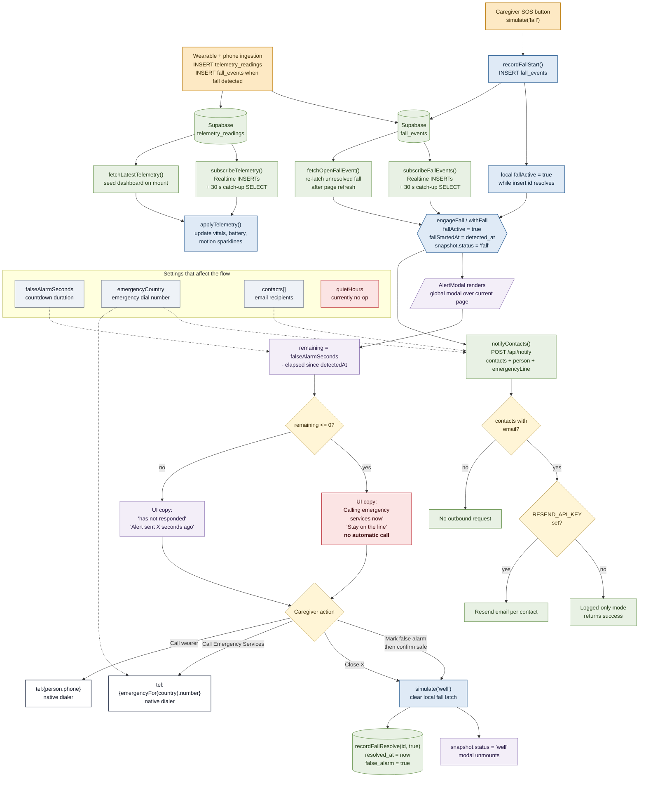

# Fall-to-reaction flow

Everything that happens between a fall reaching Supabase and the caregiver
clearing the alert. Cross-references are `file:line` so the diagram and the
code stay honest with each other.

Things to keep in mind:

- **Supabase is the live link now.** The browser no longer connects to MQTT.
  The wearable/phone ingestion path writes `telemetry_readings` and
  `fall_events` rows; the app reads them through Supabase Realtime plus a
  30-second catch-up poll.
- **The countdown is informational, not an auto-dialer.** When it reaches zero
  the modal copy changes and the ring empties. The caregiver still has to tap
  a `tel:` link to call the wearer or emergency services.
- **Dismissal records `false_alarm = true`.** There is no separate "confirmed
  fall handled" resolution path yet.
- **`quietHours` is currently a no-op.** The setting exists, but no runtime
  audio/vibration behavior consults it.

---

## Diagram

---

## Reference table

| Step | Code | Notes |
|---|---|---|
| Supabase is the app transport/history store | [supabase.ts](../src/lib/supabase.ts) | browser reads telemetry/falls; telemetry itself is written outside the app |
| Latest telemetry seeds the dashboard | [device-provider.tsx:166](../src/components/guardian/device-provider.tsx) | avoids an empty dashboard after refresh if a row already exists |
| Telemetry Realtime subscription | [supabase.ts:118](../src/lib/supabase.ts) | listens to `telemetry_readings` INSERTs and runs a 30 s catch-up SELECT |
| Open fall re-latches after refresh | [supabase.ts:182](../src/lib/supabase.ts) | reads unresolved `fall_events` rows |
| Fall Realtime subscription | [supabase.ts:208](../src/lib/supabase.ts) | listens to new `fall_events` rows |
| Fall latch | [device-provider.tsx:146](../src/components/guardian/device-provider.tsx) | sets `fallActive`, stores the row id, and notifies contacts |
| Snapshot fall overlay | [device-provider.tsx:122](../src/components/guardian/device-provider.tsx) | turns the shared snapshot into `status: "fall"` |
| SOS creates a fall row | [device-provider.tsx:310](../src/components/guardian/device-provider.tsx) | calls `recordFallStart()` and immediately latches locally |
| Fall row insert | [supabase.ts:263](../src/lib/supabase.ts) | inserts into `fall_events` for `device01` |
| Notification request | [device-provider.tsx:98](../src/components/guardian/device-provider.tsx) | best-effort `POST /api/notify` if contacts exist |
| Notification endpoint | [api/notify/route.ts:63](../src/app/api/notify/route.ts) | sends Resend email when configured; otherwise logs and returns success |
| Countdown source | [alert-modal.tsx:42](../src/components/guardian/alert-modal.tsx) | reads `settings.falseAlarmSeconds` |
| Countdown calculation | [alert-modal.tsx:67](../src/components/guardian/alert-modal.tsx) | clamps elapsed time to `0..falseAlarmSeconds` |
| Manual wearer call | [alert-modal.tsx:170](../src/components/guardian/alert-modal.tsx) | `tel:{person.phone}` |
| Manual emergency call | [alert-modal.tsx:180](../src/components/guardian/alert-modal.tsx) | `tel:{emergencyFor(country).number}` |
| Dismissal action | [alert-modal.tsx:78](../src/components/guardian/alert-modal.tsx) | calls `simulate("well")`; close X does the same directly |
| Fall row resolution | [supabase.ts:277](../src/lib/supabase.ts) | writes `resolved_at` and `false_alarm` |

---

## Gaps worth flagging

- **No automatic emergency call.** The alert copy and notification email still
  imply auto-calling, but the implemented behavior is manual `tel:` links.
  Real auto-call would require a server-side voice provider such as Twilio or
  Vonage.
- **No confirmed-fall resolution state.** The only implemented close path calls
  `recordFallResolve(id, true)`, so every resolved row becomes a false alarm.
- **`quietHours` is not wired.** The setting is persisted, but there are no
  audible or vibration cues for it to suppress.
- **Email only.** `/api/notify` sends Resend email or logs in demo mode. SMS,
  push notifications, and phone calls are not implemented.
- **Sensor ingestion is outside this repo.** The browser assumes some upstream
  wearable/phone process inserts Supabase rows. This repo documents and reads
  that contract, but it does not own the ingestion service.
